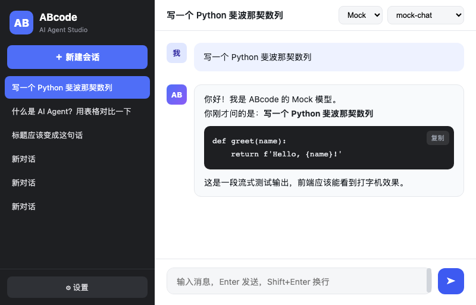

# ABcode — 本地 AI Agent 工具

> 一个开源的本地优先 AI Agent 桌面应用，类似 QwenPaw / Cherry Studio / 百炼平台。
> 后端为跨平台 Python（FastAPI），前端零框架零外网依赖，**完全本地运行，数据自己掌控**。



## ✨ 功能亮点

| 模块 | 说明 |
|------|------|
| 💬 **多会话聊天** | 流式输出、Markdown 渲染、代码高亮、附件上传、语音朗读 |
| 🔌 **多模型接入** | 内置 12+ 供应商预设（DeepSeek/OpenAI/通义/Kimi/智谱/硅基流动/Ollama/OpenRouter/ModelScope/阿里云 TokenPlan/CodingPlan/MiMo），全部 **OpenAI 兼容**；一键拉取模型列表、免费模型分级、长上下文参数 |
| 🛠 **Agent 工具调用** | 联网搜索、抓取网页、读写工作区文件、执行安全命令，自动循环直到完成 |
| 📚 **知识库 RAG** | 上传 txt/md/csv/json/代码/日志，自动分块索引，提问自动检索增强；快捷引用 `Ctrl+K` |
| 🌐 **自建搜索引擎** | 内置 Bing / 百度 / DuckDuckGo 轻量搜索，不依赖第三方搜索 API |
| ⏰ **定时任务** | 固定间隔或每日定时执行 prompt，结果写入会话 |
| 👥 **团队协作** | 成员管理、共享对话、活动日志 |
| 🧠 **专家套件** | 8 个内置专家（编程/写作/数据分析/架构/研究/翻译/安全/产品），分类筛选、一键应用 |
| 🎨 **个人偏好** | 亮/暗/护眼三主题、7 种字体、字号行高、智能辅助开关、语言、配置导入导出 |
| 🔄 **版本自更新** | 自动检查、下载进度、一键安装、备份与回滚、更新历史 |
| 🔌 **MCP 多协议** | stdio / HTTP / SSE / WebSocket / Unix Socket / TCP，6 种协议统一接入 |
| 🧩 **工作流** | 可视化画布，16 种节点（LLM/知识检索/意图分类/参数提取/工具/数据连接/条件/文本处理/聚合/代码/HTTP/模板…），6 个内置模板，可视化执行 |
| 🗄️ **数据连接器** | SQLite / MySQL / PostgreSQL / CSV / JSON / HTTP 六类数据源查询 |
| 🖥 **Mac 原生 App** | Swift WKWebView 壳，双击运行，自带后端依赖 |

## 🔻 快速开始

### Mac（推荐，有原生 App）

1. 下载最新 `ABcode-mac-*.zip`（见 [下载](#-下载)）
2. 解压，把 `ABcode.app` 拖入「应用程序」
3. 双击运行（首次右键 → 打开，绕过 Gatekeeper）
4. 首次运行自动在 `127.0.0.1:8900` 启动后端并加载界面
   - 数据保存在 `~/Library/Application Support/ABcode/`
   - 后端日志：`~/Library/Application Support/ABcode/backend.log`

> 要求 macOS 12+ 且已安装 Python 3.9+（Xcode 自带即可）。

### Windows / Linux / 任意平台（源码运行）

```bash
# 1. 克隆仓库
git clone https://github.com/<your-name>/abcode.git
cd abcode

# 2. 创建虚拟环境并安装依赖
python3 -m venv .venv
source .venv/bin/activate          # Windows: .venv\Scripts\activate
pip install -r backend/requirements.txt

# 3. 启动后端（默认 8900 端口）
#    命令行快捷方式：
./start.sh                          # macOS / Linux
start.bat                           # Windows（自动打开浏览器）

#    或直接：
python -m uvicorn main:app --host 0.0.0.0 --port 8900 --app-dir backend

# 4. 浏览器访问
open http://127.0.0.1:8900          # 会自动打开
```

详见 [docs/INSTALL.md](docs/INSTALL.md)。

## ⚙️ 使用说明

1. **添加供应商**：设置 → 供应商 → 添加。填 Base URL / API Key / 模型列表，可一键「获取模型列表」，或用内置预设模板（标注了免费模型和上下文长度）。
2. **Agent 开关**：顶栏可开关工具调用（纯聊天模式）。
3. **知识库**：左下角 📚 → 上传文档 → 提问自动检索增强；`Ctrl+K` 快速引用。
4. **定时任务**：左下角 ⏰ → 配置间隔或每日时间 → 自动执行。
5. **工作流**：扩展能力 → 工作流 → 新建/套用模板 → 拖拽节点连线 → 运行。
6. **数据连接器**：扩展能力 → 连接器 → 添加 SQLite/MySQL/PostgreSQL/CSV/JSON/HTTP。
7. **MCP**：扩展能力 → MCP → 选择 6 种协议之一 → 配置 → 启用。
8. **团队 / 专家**：扩展能力 → 团队协作 / 专家套件。

## 📁 工具列表

- `get_current_time` 获取当前时间
- `web_search` 联网搜索（可选对接自建搜索服务）
- `fetch_url` 抓取网页正文
- `list_files` / `read_file` / `write_file` 工作区文件操作
- `run_shell` 执行安全 shell 命令（内置危险命令拦截）

## 🧩 工作流节点（16 种）

🏁 开始 · 🤖 LLM · 📚 知识检索 · 🎯 意图分类 · 📑 参数提取 · 🔧 工具 · 🗄️ 数据连接 · 🔀 条件 · 📝 变量 · ✂️ 文本处理 · 🧮 聚合 · 💻 代码 · 🌐 HTTP · 📄 模板 · 🛑 直达(提前终止) · 🏁 结束

## 🔌 支持协议 / 模型格式

- **模型 API**：全部 OpenAI 兼容（`chat/completions`），含 Ollama 本地；新增 ModelScope 格式
- **MCP**：stdio / HTTP / SSE / WebSocket / Unix Socket / TCP

## 📚 文档

| 文档 | 说明 |
|------|------|
| [docs/INSTALL.md](docs/INSTALL.md) | 各平台安装与运行（Mac/Windows/Linux） |
| [docs/ARCHITECTURE.md](docs/ARCHITECTURE.md) | 架构设计 |
| [docs/API.md](docs/API.md) | 后端 API 参考 |
| [docs/CONFIGURATION.md](docs/CONFIGURATION.md) | 供应商与模型配置 |
| [docs/CONTRIBUTING.md](docs/CONTRIBUTING.md) | 参与贡献 |
| [CHANGELOG.md](CHANGELOG.md) | 更新记录 |

## 🗺 路线图

- [x] 官方 Docker 镜像
- [x] Windows 原生打包（Nuitka 高混淆单 exe，保护源码）
- [ ] Linux 原生打包（deb/AppImage）
- [ ] 多 Agent 协作

## 🏗 项目结构

```
abcode/
├── backend/                # FastAPI 后端（跨平台 Python）
│   ├── main.py             # 入口：全部 API + Agent 循环 + 定时调度 + 工作流
│   ├── llm.py              # 模型调用（OpenAI 兼容 + Ollama，流式 + 工具）
│   ├── agent.py            # 工具注册与执行
│   ├── rag.py              # 知识库分块与检索
│   ├── cron.py             # 定时任务调度
│   ├── db.py               # SQLite 数据层
│   ├── connector.py        # 数据连接器
│   ├── mcp_client.py       # MCP 客户端（6 种协议）
│   ├── workflow.py         # 工作流执行引擎（16 种节点）
│   ├── skills.py           # 技能
│   ├── updater.py          # 自动更新
│   └── search_engine/      # 自建搜索引擎（Bing/百度/DDG）
├── frontend/               # 前端（原生 JS，零框架、零外网依赖）
├── macapp/                 # Mac 原生 App（Swift WKWebView 壳 + 打包脚本）
├── tests/                  # Mock 模型 / MCP 测试服务器
├── start.sh / start.bat    # 跨平台启动脚本
└── README.md
```

## 📄 许可证

[MIT](LICENSE) © ABcode contributors